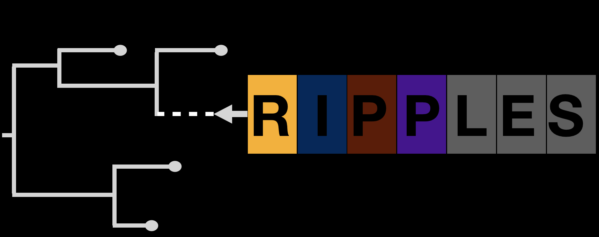

# **Recombination Inference using Phylogenetic PLacEmentS** (RIPPLES)

RIPPLES is a program to detect recombination events in large mutation annotated trees (MAT).  This repo contains a workflow for running RIPPLES on Google Cloud Platform.

Please also refer to this tutorial for examples using RIPPLES : [RIPPLES Tutorial](https://usher-wiki.readthedocs.io/en/latest/ripples.html)

# RIPPLES on Google Cloud Platform

<br>

## Setup your Google Cloud Platform Account
___

1. **Setup Cloud Console:**
	- If needed, please follow these instructions to open Cloud Console, create a project storage bucket (`bucket_id`) and project ID (`project_id`):
       	[Installation and Setup](https://cloud.google.com/deployment-manager/docs/step-by-step-guide/installation-and-setup)

<br>

2. **Add a service account**:
	- Click the Navagation Menu side bar on the GCP Console and go to `IAM & Admin` -> `Service Accounts`. Click `+Create Service Account`. 

<br>

3. **Create and Download Keys(JSON)**
	- Once you have created a service account, you need to add keys to this serivce account.
	Click the Navagation Menu side bar on the web console and go to `IAM & Admin` -> `Service Accounts` and click on the active service account you just created from the previous step.

	- Click the `Keys` tab and `ADD KEY` and `Create new key`.  Select `JSON` key type.  A new `<key>.json` file will automatically be downloaded from your browser.

	- Move this downloaded `<key>.json` file to the following location (or edit the command below for the location of your choice):

		```
		~/.config/gcloud/<key>.json
		```

	-  Then run the following command in your terminal to set the environment variable path to the location where you just placed your downloaded `<keys>.json` file.

		```
		KEY=~/.config/gcloud/<keys>.json
		```

<br>


## Run RIPPLES (Docker workflow)
___

Pull and run public RIPPLES Docker image with the following command. Replace the name of your `<keys>.json` file in the command below:
```
docker run -it -v ${KEY}:/tmp/keys/<keys>.json:ro mrkylesmith/ripples_pipeline:latest
```

This will place you into an interactive (`-it` flag) Docker container shell where you will be able to launch RIPPLES jobs on GCP. The Docker image is configured with all the necessary installs and dependencies needed to run RIPPLES pipeline.

<br>


## Setup Access to GCP Account and configure RIPPLES job
___

There is a blank template configuration file located in the `template/` directory. Copy it into the current directory and edit the file, following the instructions below to set your configurations.
```
cp template/ripples.yaml .
```

### Grant access to GCP account
- Add your bucket ID, project ID, and the name of your downloaded `<keys>.json` file to the `ripples.yaml` configuration file like this: 
```
bucket_id: <your_bucket_id> 
project_id: <your_project_id> 
key_file: /tmp/keys/<your_key_file.json>
```

<br>

## Configure RIPPLES parameters and GCP instance type
___
This RIPPLES workflow takes two main inputs described in more detail below:
- MAT protobuf 
- raw sequence(`.fa`) file that you have placed in your Google Cloud Storage Bucket (`bucket_id`)

Set configurations for the current RIPPLES job you want to run in `ripples.yaml` , shown below:
```
 # Ripples parameters config
 version: ripples-fast
 mat: <mat.pb>
 date: <2021-07-02>
 raw_sequences: <raw_sequences>.fa
 reference: <reference.fa>
 results: <results>
 
 # GCP machine and Storage Bucket config
 instances: 4
 boot_disk_size: 30
 machine_type: e2-standard-16
 logging: <example.log>

```
### RIPPLES Options:
- `version`: Set as `ripples` or `ripples-fast` to run fast verison of RIPPLES program

- `mat`: The Mutation Annotated Tree (MAT) protobuf that you want to search for recombination events. 

- `date`: Set the date for the given input tree.

- `raw_sequences`: A raw sequence file that contains all the raw sequences for a set of descendent nodes in the tree.

- `reference`: SARS-CoV-2 reference genome

- `results`: The output directory where RIPPLES will output results on GCP Storage Bucket and locally within interactive Docker shell where RIPPLES job is launched.  
NOTE: You should create your empty `results` directory on GCP Storage Bucket before you run this pipeline.

- `num_descendants`: Minimum number of leaves a node should have to be considered for recombination.[OPTIONAL] (Default = 2)

### GCP Instance Type Options:
- `instances`: Number of GCP instances that RIPPLES will be parallelized across.  Results will be automatically aggregated into `results` directory on your GCP Storage Bucket and locally when all RIPPLES jobs are complete.

- `boot_disk_size`: Instance startup disk size. **Leave as 30GB**.

- `machine_type`: Select the GCP instance type you would like to launch.  

- `logging`: Name of the logging file for this particular RIPPLES job that will be output into your GCP Storage bucket under `bucket_id/logging/<logging>`.

<br>

**Note:** All of the configurations above should be updated/changed as needed for each separate RIPPLES job that is run.

<br>

## Running your RIPPLES job
___

Execute the following command to launch your RIPPLES job according to the set configurations in `ripples.yaml`.
```
python3 run.py
```
Once all jobs are complete, the dectected recombinants will be placed in the specified `<results/>` directory.

## RIPPLES Output
The following two files will be output:
- `recombinants_<date>.txt`: This is the final output file, containing all dectected recombinants found in the input tree, one per line. 

- `unfiltered_recombinants<date>.txt`: File containing the unfiltered recombinants that were detected after running RIPPLES search, but not run through filtration/QC pipeline.
